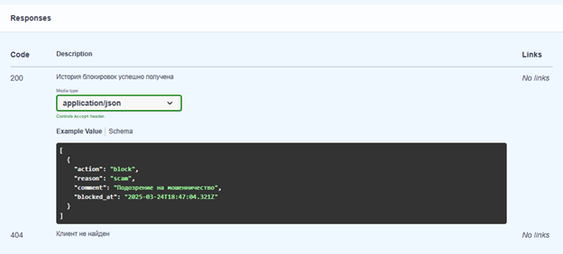

# Блокировки платежей (API + БД)

## Построение концептуально-инфологической модели

### 1. Формирование сущностей

| Сущность            | Описание                          |
|---------------------|---------------------------------|
| `client`           | Хранение информации о клиентах  |
| `client_block`     | Хранение текущих блокировок     |
| `client_block_history` | Хранение истории блокировок и разблокировок |

### 2. Определение атрибутов и требований к ним для каждой сущности

#### `client`
| Название атрибута | Тип  | Описание                     |
|-------------------|------|-----------------------------|
| `id` (PK)        | UUID | Идентификатор клиента       |

В качестве первичного ключа выбран атрибут `id`, поскольку он однозначно идентифицирует клиента банка.

#### `client_block`
| Название атрибута | Тип         | Описание                                        |
|-------------------|------------|------------------------------------------------|
| `id` (PK)        | UUID       | Идентификатор блокировки                        |
| `client_id` (FK) | UUID       | Идентификатор клиента                          |
| `reason`        | ENUM       | Причина блокировки (`scam`, `incorrect_details`) |
| `comment`       | TEXT       | Комментарий                                    |
| `blocked_at`    | TIMESTAMP  | Дата и время блокировки                        |

Атрибут `client_id` является внешним ключом сущности `client_block`.

#### `client_block_history`
| Название атрибута | Тип         | Описание                                        |
|-------------------|------------|------------------------------------------------|
| `id` (PK)        | UUID       | Идентификатор записи                          |
| `client_id` (FK) | UUID       | Идентификатор клиента                         |
| `action`        | ENUM       | Действие (`block`, `unblock`)                  |
| `reason`        | ENUM       | Причина блокировки (`scam`, `incorrect_details`) |
| `comment`       | TEXT       | Комментарий                                   |
| `created_at`    | TIMESTAMP  | Дата и время блокировки                       |

### 3. Выявление связей между сущностями
1. `client` - `client_block`: один к одному  
   - Один клиент может иметь ноль или одну запись о блокировке.  
   - Каждая запись о блокировке относится только к одному клиенту.  
2. `client` - `client_block_history`: один ко многим  
   - Один клиент может иметь несколько записей в истории блокировок.  
   - Каждая запись в истории относится только к одному клиенту.  

---
### 4. ER-диаграмма
 

---

### 5. Endpoint’ы

Интерактивная Swagger-документация (OpenAPI 3.0) доступна здесь:

Файл спецификации OpenAPI в формате YAML находится в [репозитории этого проекта](openapi.yaml). Интерактивная Swagger-документация (OpenAPI 3.0) расположена на [GitHub Pages данного репозитория](https://medentseva-elizaveta.github.io/Blocking_payments/).


### 5.1. Блокировка клиента `POST /client/{id}/block`
**Логика работы:**
1. Проверка существования клиента с `id`.
2. Проверка отсутствия активной блокировки в `client_block`.
3. Создание записи в `client_block`:
   - `id` - идентификатор записи
   - `client_id` - идентификатор клиента
   - `reason` - причина (`scam`, `incorrect_details`)
   - `comment` - комментарий сотрудника
   - `blocked_at` - дата и время создания записи
4. Создание записи в `client_block_history`:
   - `id` - идентификатор записи
   - `client_id` - идентификатор клиента
   - `action` - действие (`block`)
   - `reason` - причина (`scam`, `incorrect_details`)
   - `comment` - комментарий сотрудника
   - `created_at` - дата и время создания записи 
5. Возврат статуса **`201 (Created)`** при успешном выполнении запроса.

 

---

### 5.2. Разблокировка клиента `POST /client/{id}/unblock`
**Логика работы:**
1. Проверка существования клиента с `id`.
2. Проверка наличия активной блокировки в `client_block`.
3. Удаление записи из `client_block` с `client_id`=`id`.
4. Создание записи в `client_block_history` (`action`=`unblock`).
5. Возврат статуса **`200 (OK)`** при успешном выполнении запроса.

 

---

### 5.3. Проверка статуса `GET /client/{id}/status`
**Логика работы:**
1. Проверка существования клиента с `id`.
2. Поиск активной блокировки в `client_block`.
3. Если запись найдена, возвращается **`200 (OK)`** с телом ответа:
   ```json
   {
     "blocked": true,
     "reason": "scam"
   }

 

---

### 5.4. История блокировок `GET /client/{id}/block/history`
**Логика работы:**
1. Проверка существования клиента с идентификатором `id`.
2. Получение записей из таблицы `client_block_history` с `client_id`=`id`, `reason`= `scam/incorrect_details`, в зависимости от переданного query-параметра и пагинацией
3. Возврат статуса **`200 (OK)`** с телом ответа, в котором содержится список записей о блокировках.

 
 

---
